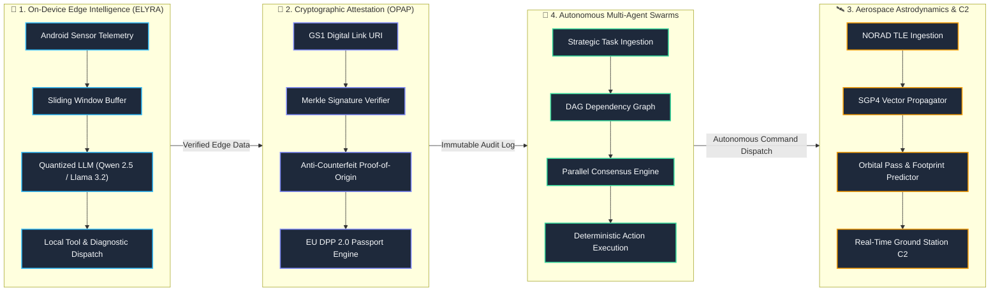
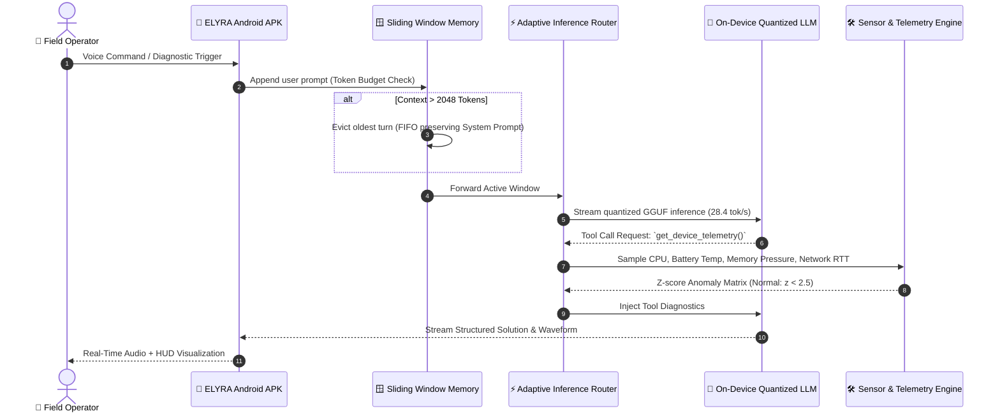
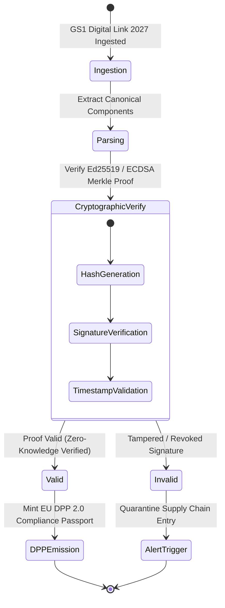

# ⚡ Systems Architect & Research Engineer

  <b>Building zero-latency on-device Edge AI, real-time aerospace orbital mechanics & astrodynamics, and high-assurance cryptographic verification protocols.</b>

---

## 🏛️ End-to-End System Engineering & Execution Pipelines

### 1. Global Systems Workflow & Orchestration Pipeline

---

### 2. ELYRA On-Device Inference & Telemetry Pipeline

---

### 3. OPAP Cryptographic Verification State Machine

---

## 🛠️ Core Technology Matrix

| Domain | Core Stack & Frameworks | Highlights |
|---|---|---|
| **📱 On-Device Edge AI** | Python 3.12, FastAPI, Ollama, GGUF, React Native, Expo SDK 51 | [ELYRA Android APK](https://github.com/freshstart2066-create/elyra) with sub-second telemetry triage |
| **🔐 Applied Cryptography** | Rust, Python, Web3, Ed25519, Merkle Trees, SHA-256 | [OPAP Protocol](https://github.com/freshstart2066-create/opap-protocol) for GS1 Digital Link 2027 & EU DPP 2.0 |
| **🛰️ Aerospace & Astrodynamics** | SGP4, Orekit, Python, Three.js / WebGL, Cesium | Real-time orbital propagation and ground station tracking |
| **🤖 Autonomous Agent Swarms** | Python AsyncIO, DAGs, Redis, WebSockets | Multi-agent task execution and self-healing consensus networks |
| **🎨 Creative & Motion Design** | WebGL, Three.js, Canvas Physics, Web Audio DSP, Tailwind | High-framerate interactive glassmorphism & HUD emulators |

---

## 🚀 Featured Open-Source Repositories

- ⚡ **[ELYRA](https://github.com/freshstart2066-create/elyra)** — Autonomous Mobile Edge AI & Telemetry Assistant (Standalone Android APK)
- 🔐 **[OPAP Protocol](https://github.com/freshstart2066-create/opap-protocol)** — Open Product Authentication Protocol (GS1 2027 & EU DPP 2.0)
- 🛰️ **[Project Cherub](https://github.com/freshstart2066-create/project-cherub)** — Autonomous Spacecraft Astrodynamics & C2 Engine (SGP4/SDP4)
- 🤖 **[CortexFlow](https://github.com/freshstart2066-create/cortexflow)** — Autonomous Task Routing & Verification DAG Swarm
- 🌐 **[Interactive Portfolio](https://freshstart2066-create.github.io)** — Live Motion-Designed Interactive Hub

---

  Engineered with precision. Continuous integration & automated attestation verified.

